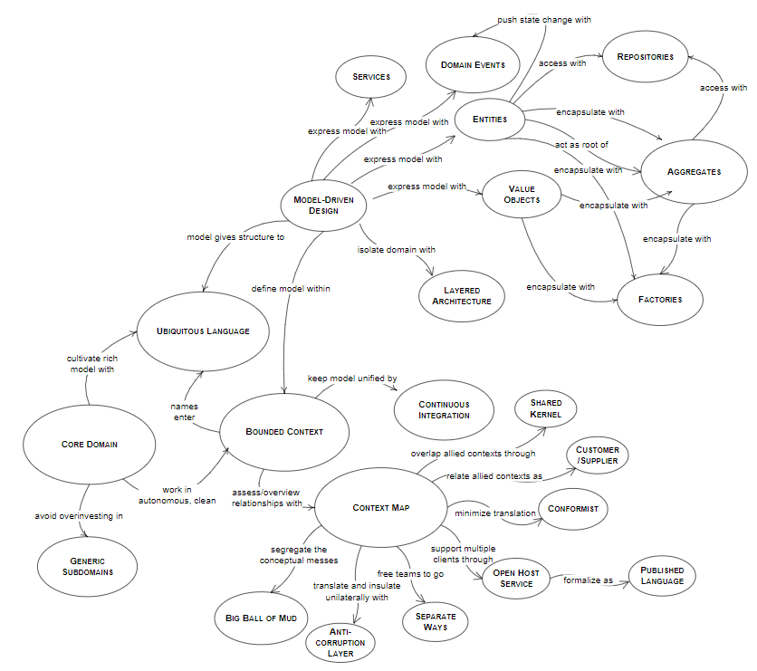
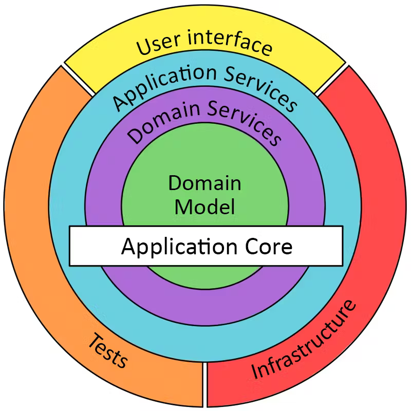

# DDD

## Visão Geral

- **Core Domain**

- **Ubiquitous Language**

- **Bounded Contexts**
    - **Context Map**
    - **Context Mapping**
        - **Cooperation**
            - **Partnership**
            - **Shared Kernel**
        - **Customer-Supplier**
            - **Conformist**
            - **Anticorruption Layer**
            - **Open-Host Service**
                - **Published Language**

- **Domain Model Pattern**
    - **Entities**
    - **Value Objects**
    - **Aggregate Objects**
    - **Domain Events**
    - **Repositories**
    - **Factories**
    - **Domain Services**
    - **Application Services**
    - **Infrastructure Services**
    - **Data Transfer Objects**
    - **Unit of Work**

- **Layered Architecture**

    - **Domain Layer**
    - **Application Layer**
    - **Infrastructure Layer**
    - **Presentation Layer (UI Layer)**

## Síntese

- **Core Domain**

    A parte mais vital e estratégica do negócio. O Core Domain é o coração do negócio. Deve ser bem compreendido e bem modelado para que o sistema tenha sucesso.

- **Ubiquitous Language**

    Conjunto comum de termos e definições usado por toda a equipe, tanto técnica quanto não técnica.
    
    Geralmente quando dividimos a organização em contextos, cada um desses contextos possui uma linguagem própria. Logo, deve existir uma linguagem comum que realize o interfaceamento da comunicação entre os especialistas de contexto, os desenvolvedores e os usuários do sistema, essa linguagem é a *Ubiquitous Language*. Cada contexto possui sua própria *Ubiquitous Language*.
    
    
    O ideal é que essa linguagem seja formulada visando os termos do próprio contexto em questão. Também é necessário existir um *Domain Expert*, que é uma pessoa profundamente conhecedora do negócio, onde devido a esse conhecimento amplo esse mesmo *Domain Expert* será responsável por definir a *Ubiquitous Language* do contexto em questão.

    Importante se atentar que existem duas linguagens:

    - 1°) A linguagem do *Bounded Contexts*.
    - 2°) A linguagem (ou estrutura) que realiza o interfaceamento entre os *Bounded Contexts*.

- **Bounded Contexts**

    Isolamento das partes do sistema. É o mapeamento dos escopos que compõem um sistema.

    - **Context Map**

        O mapa de contexto é uma representação visual dos *Bounded Contexts* do sistema e das integrações entre eles.

        | | |
        | -------- | ------- |
        |  |  |

    - **Context Mapping**

        Descreve as relações que existem entre os *Bounded Contexts*.

        Tipos de relações:

        - **Cooperation**

            Equipes com comunicação bem estabelecida e de natureza tendente a bidirecional.

            - **Partnership**
            
                Uma equipe pode notificar outra sobre uma mudança, e a segunda equipe cooperará e se adaptará sem drama ou conflitos. A coordenação da integração aqui é bidirecional. Nenhuma equipe dita a linguagem usada para definir os contratos.

                

            - **Shared Kernel**

                É uma forma mais formal de definir um contrato entre múltiplos *Bounded Contexts*, o contrato é definido explicitamente em uma biblioteca compilada. A biblioteca define os métodos de integração e a linguagem usada por ambos os contextos. A chave para implementar o padrão é manter o escopo do *Shared Kernel* pequeno e limitado apenas ao contrato de integração.

                

        - **Customer-Supplier**

            Equipes com comunicação estabelecida na estrutura de consumidor e fornecedor.

            - **Conformist**

                Quando o fornecedor dita as regras e o consumidor apenas se conforma com as mesmas (é pegar ou largar). Neste cenário o consumidor está disposto a aceitar o modelo do fornecedor.

                

            - **Anticorruption Layer**

                Assim como no padrão *Conformist* o consumidor continua inclinado a conformar-se ao modelo do fornecedor, no entanto, é preferível adaptar a interface de interação com o fornecedor para algo que satisfaz mais do consumidor. O padrão da camada anticorrupção aborda cenários em que não é desejável ou não vale o esforço para se adequar ao modelo do fornecedor, tais como: sistemas legados, bibliotecas complexas onde queremos apenas usar parte de suas features, sistemas com domínio diferente, sistema com domínios bagunçados onde não queremos herder tal bagunça.

                

            - **Open-Host Service**

                Fornece uma API estável para o serviço (fornecedor), ocultando alterações de implementação dos clientes (consumidores) para protegê-los.

                A interface pública do fornecedor não se destina a estar em conformidade com a sua linguagem onipresente. Em vez disso, pretende-se expor um protocolo conveniente para os consumidores, expresso numa linguagem orientada para a integração. Conseqüentemente, o protocolo público é chamado de **Published Language**.

                - **Published Language**

                    Camada de tradução entre dois modelos diferentes para expressar as informações e comportamentos existentes em cada *Bounded Contexts* envolvido.

                

- **Domain Model Pattern**

    

    - **Entities**

        É a representação de objetos onde os mesmos possuam uma identidade, ou seja, suas propriedades podem variar e o objeto ainda continua sendo o que ele é.

        No mundo real, certos objetos possuem uma identidade única que perdura ao longo do tempo, apesar de sofrerem vários estados ou mudanças. O conceito de entidades representa tais objetos dentro do domínio de software. As entidades são definidas principalmente pela sua identidade distinta. Por exemplo, num sistema de gestão de clientes, um cliente é uma entidade com uma identidade persistente, independentemente de alterações no seu nome, endereço ou outros atributos.

    - **Value Objects**

        É a representação de objetos onde não pode haver mudança de suas propriedades, ou seja, se as propriedades mudam, o objeto passa a ser outro.

        Alguns objetos dentro do domínio são caracterizados principalmente pelos seus atributos, e não por uma identidade única, esses são os *Value Objects*. Eles costumam ser imutáveis, o que significa que seu estado não pode ser alterado depois de criados. Eles podem ser substituídos livremente por outra instância com os mesmos atributos sem alterar o estado geral do sistema. Exemplos: intervalos de datas, endereços ou valores monetários.
        
    - **Aggregate Objects**

        *Entities* e *Value Objects* geralmente possuem relacionamentos e dependências significativas, os agregados servem como clusters que agrupam as *Entities* e os *Value Objects*, tratando-os como uma única unidade. Um agregado possui uma *entidade raiz*, conhecida como *raiz agregada*, por meio da qual ocorrem todas as interações com o agregado. Os agregados mantêm a consistência e a integridade dos objetos relacionados, garantindo que as alterações no cluster permaneçam coerentes e sigam as regras e invariantes do domínio.

        É um grupo de objetos que são tratados como uma única unidade. As agregações são importantes porque definem limites de consistência, impõem invariantes, incentivam uma abordagem top-down e atuam como uma camada de abstração. São diversas entidades que estão no mesmo contexto e que se consomem. São clusters de *Entities* e *Value Objects* que são tratados como uma única unidade para fins de gerenciamento de estado e consistência.

    - **Domain Events**

        A essência de um *Domain Event* é que você o usa para capturar coisas que podem desencadear uma mudança no estado do sistema. Esses objetos de evento são então processados para causar alterações no sistema e armazenados para fornecer um Audit Log. Devemos usá-los para capturar uma ocorrência de algo que aconteceu no domínio.

        Exemplo de alterações no sistema que podem ser processadas com *Domain Events*: change address, place order, create user, create product, change price.

        O evento é a consequência, ou reação, de uma ação que aconteceu no passado. Após a ação ocorrer, notificamos as partes interessadas, e isso é feito com *Domain Events*.

        Não devemos confundir *Domain Events* com *Event Sourcing*. Um *Domain Event* expressa algo que aconteceu no sistema (remete a noção de passado). *Event Sourcing* trata-se do armazenamento da série de eventos que representam os estados de um objeto.

        Um *Domain Event* é qualquer coisa que aconteceu no modelo de domínio e que pode ser de interesse para outras partes do sistema.

        
        

    - **Repositories**

        Possuem acesso direto a camada de dados podendo persistir dados e realizar as consultas. Devemos utilizar um repositório por agregação, é utilizado apenas um repositório por agregação. Um repositório pode consultar diretamente serviços externos.

        Ele atua como uma ponte entre a nossa lógica de negócios e o modo como armazenamos os dados, mais especificamente tratando da abstração de agregados.

        É uma interface que nos permite interagir com agregados, unidades de regras de negócio e dados que devem ser tratados juntos. É um padrão que separa a lógica de negócios da persistência de dados.

        O Repository é uma abstração que facilita a interação com agregados, atuando como um mediador entre a lógica de negócios e a persistência de dados. É errôneo considerar o Repository como a única forma de acesso ao banco de dados; sua aplicação deve ser contextualizada e adequada.

        É basicamente uma camada que fica entre o domínio do seu projeto e o banco de dados. Atua como um local de armazenamento para objetos globalmente acessíveis e também pode incluir uma estratégia. Pode acessar um armazenamento de persistência ou outro com base na estratégia especificada.

        Fornecem uma abstração para o armazenamento e recuperação de Agregados. Eles permitem que os desenvolvedores trabalhem com objetos de domínio sem ter que se preocupar com os detalhes de como esses objetos são persistidos no banco de dados.

    - **Factories**

        Responsável por construir adequadamente um objecto/entidade.

        Os Repositórios persistem os dados em um banco de dados, e as Factories constroem novos objetos. Um lida com os dados, o outro lida com a construção do objeto. São usadas para criar Agregados ou Entidades complexas que têm regras de criação específicas.

    - **Domain Services**

        Implementam a lógica de negócios a partir da definição de um *Domain Expert*. Trabalham com diversos fluxos de diversas entidades e agregações, utilizam os repositórios como interface de acesso aos dados e consomem recursos da camada de infraestrutura, como: enviar email, disparar eventos, entre outros.

        Características fundamentais dos *Domain Services*: refletem comportamento, não têm identidade, são stateless (sem estado); você pode usar com frequência para orquestrar várias entidades e objetos de domínio; contêm lógica de domínio que não pertence a uma entidade ou *Value Object*, são usados para atender partes do negócio que não se encaixam em entidades específicas.

        Encapsulam a lógica de negócios que não cabe naturalmente em um objeto de domínio e não são operações CRUD típicas (elas pertenceriam a um Repositório). São usados para encapsular a lógica de negócio que não se encaixa naturalmente dentro de uma Entidade ou Objeto de Valor. No planejamento urbano, um exemplo de um Serviço de Domínio poderia ser um "Serviço de Planejamento de Rotas", que leva em consideração várias "Estradas", "Edifícios" e "Zonas" para calcular a melhor rota entre dois pontos.

        Quando um processo ou transformação significativa no domínio não for uma responsabilidade natural de uma entidade ou objeto de valor, adicione uma operação ao modelo como interface autônoma declarada como serviço. Defina a interface em termos do idioma do modelo e certifique-se de que o nome da operação faça parte da linguagem ubíqua. Torne o service sem estado (stateless).

        Os serviços de domínio incorporam e operam sobre conceitos de domínio e fazem parte da linguagem onipresente. 

    - **Application Services**

        Usados ​​por consumidores externos para se comunicarem com o sistema (pense em serviços da Web). Se os consumidores precisarem de acesso as operações CRUD, eles estarão expostos aqui.

        Um serviço de aplicação tem uma função importante e distintiva: fornece um ambiente de hospedagem para a execução da lógica de domínio. Além de ser um host, o objetivo de um serviço de aplicação é expor a funcionalidade do domínio a outras camadas de aplicação como uma API. Isso atribui uma função de encapsulamento ao serviço - o serviço é uma instância do padrão Facade.

        Os serviços de domínio são muito granulares, enquanto os serviços de aplicativo são uma fachada destinada a fornecer uma API. Os serviços de domínio contêm lógica de domínio que não pode ser naturalmente colocada em uma entidade ou objeto de valor, enquanto os serviços de aplicativo orquestram a execução da lógica de domínio e não implementam nenhuma lógica de domínio.

    - **Infrastructure Services**

        Usado para abstrair preocupações técnicas (por exemplo, MSMQ, provedor de e-mail, e semelhantes). Os serviços de infraestrutura concentram-se no encapsulamento dos requisitos de "encanamento" de uma aplicação; geralmente preocupações de IO, como acesso ao sistema de arquivos, acesso ao banco de dados, e-mail, etc.

    - **Data Transfer Objects**

        São usados ​​para transferir dados entre a camada de aplicação e a camada de apresentação ou outro tipo de clientes. Os *Application Services* devem retornar apenas o que é necessário pela camada de apresentação (ou cliente), nem mais, nem menos. Eles fornecem uma maneira eficiente de abstrair objetos de domínio da camada de apresentação. Os *Application Services* obtêm e retornam DTOs em vez de entidades.

        É um objeto que transporta dados entre processos, não possui nenhum comportamento exceto armazenamento, recuperação, serialização e desserialização de seus próprios dados (mutadores, acessadores, analisadores e serializadores). Em outras palavras, DTOs são objetos simples que não devem conter nenhuma lógica de negócio, mas podem conter mecanismos de serialização e desserialização para transferência de dados entre as partes do sistema.

        É um padrão de design crucial que assegura uma comunicação eficiente e robusta entre as camadas de software. Ele é expresso em uma representação dos dados de interesse. A habilidade de converter um DTO para um objeto de domínio e vice-versa é uma das principais razões pela qual o DTO é tão valioso.

    - **Unit of Work**

        Garante que essas operações sejam atômicas (todas bem-sucedidas ou todas falhem). É fundamental para a consistência dos dados.

        O padrão rastreia alterações feitas em objetos de domínio em uma transação e garante que todas as alterações sejam confirmadas juntas ou revertidas se ocorrer um erro. Esse padrão é particularmente útil ao lidar com processos de negócios complexos que envolvem diversas entidades.

- **Layered Architecture**

    As dependências entre as camadas são voltadas para dentro. Ou seja, as camadas de nível superior só podem depender das camadas de nível inferior. Por exemplo, a camada de domínio só pode depender de outro código dentro da camada de domínio. A camada de aplicativo pode depender da camada de domínio e de outros códigos da camada de aplicativo, mas não pode depender da camada de UI (Apresentação).

    | | |
    | -------- | ------- |
    |  |  |
    |  |  |
    |  |  |
    
    
    
    

    - **Domain Layer**
        
        A camada de domínio contém a lógica de negócios e as regras que definem o comportamento do sistema. Um fator importante é que os objetos não tenham muitos detalhes técnicos, como conexão com o banco de dados (não depende de como e onde os objetos estão armazenados). O modelo de domínio de negócios deve ser escrito utilizando a linguagem ubíqua.

    - **Application Layer**

        A camada de aplicação coordena as interações entre as camadas de domínio e de infraestrutura. É responsável pela criação e recuperação de objetos de domínio, bem como pela chamada de seus métodos para satisfazer necessidades do usuário. É a camada onde os fluxos dos processos de negócios são tratados.

    - **Infrastructure Layer**

        A camada de infraestrutura fornece os serviços e a infraestrutura necessários para o sistema, como bancos de dados, filas de mensagens e semelhantes.

    - **Presentation Layer (UI Layer)**

        A camada de apresentação fornece a interface para os usuários interagirem com o sistema (API, interface Web, etc).

## Links

- https://martinfowler.com/bliki/UbiquitousLanguage.html
- https://www.oreilly.com/library/view/what-is-domain-driven/9781492057802/ch04.html
- https://fullcycle.com.br/principais-conceitos-sobre-domain-events/
- https://www.eduardopires.net.br/2016/03/ddd-bounded-context/
- https://redis.io/glossary/domain-driven-design-ddd
- https://medium.com/@chaojie.xiao/domain-driven-design-practice-domain-events-15b38f3c58fc
- https://medium.com/@carlosbueno.kinder/o-que-%C3%A9-domain-services-como-usar-f8a31410b165
- https://learn.microsoft.com/en-us/dotnet/architecture/microservices/microservice-ddd-cqrs-patterns/ddd-oriented-microservice
- https://learn.microsoft.com/en-us/dotnet/architecture/microservices/microservice-ddd-cqrs-patterns/infrastructure-persistence-layer-design
- https://elemarjr.com/clube-de-estudos/artigos/ddd-para-que-serve-o-repository/
- https://fullcycle.com.br/o-que-e-dto/
- https://docs.abp.io/en/abp/latest/Data-Transfer-Objects
- https://www.hibit.dev/posts/14/domain-driven-design-introduction
- https://www.hibit.dev/posts/15/domain-driven-design-layers
- https://www.hibit.dev/posts/16/domain-driven-design-components
- https://devnit.medium.com/entendendo-o-domain-driven-design-uma-perspectiva-pr%C3%A1tica-atrav%C3%A9s-do-mundo-do-planejamento-urbano-91c9dc8c04b6
- https://devnit.medium.com/a-m%C3%A1gica-por-tr%C3%A1s-da-convers%C3%A3o-de-dados-o-padr%C3%A3o-dto-explicado-25f68a718b5a
- https://stackoverflow.com/questions/31438286/ddd-which-layer-dto-should-be-implemented
- http://gorodinski.com/blog/2012/04/14/services-in-domain-driven-design-ddd/
- https://martinfowler.com/eaaCatalog/unitOfWork.html
- https://www.devmedia.com.br/unit-of-work-o-padrao-de-unidade-de-trabalho-net/25811
- https://medium.com/@ruben.alapont/repository-and-unit-of-work-in-domain-driven-design-cc5638780dc3
- https://en.wikipedia.org/wiki/GRASP_(object-oriented_design)
- https://www.seguetech.com/waterfall-vs-agile-methodology/
- https://medium.com/airwallex-engineering/domain-driven-design-practice-modeling-payments-system-f7bc5cf64bb3
- https://medium.com/@DrunknCode/clean-architecture-simplified-and-in-depth-guide-026333c54454

