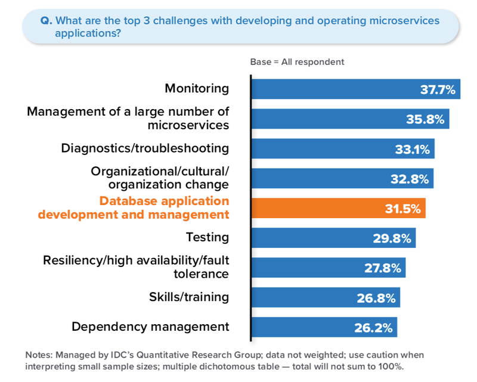

# Microservice

## Pontos importantes

- **Consistência eventual**

    Trata-se da ideia de que os dados vão se tornar consistentes com o tempo. Quando temos uma rede de nós onde há diferença de tempo de atualização das informações sincronizadas entre os nós, inicialmente temos uma certa inconsistẽncia nos dados, mas com o tempo os nós são todos sincronizados com as mesmas informações, ou seja, os dados passam a ficar consistentes.

    Lidar com esse fator temporal, onde podemos dizer que há tempos diferentes de acordo com as ações, é algo próprio da consistência eventual, aparentemente.

- **Mensagens assíncronas**

    É recomendado que as comunicações sejam sempre assíncronas entre os microservices, de modo que cada microservice possa operar dentro do escopo de suas condições de ambiente.

- **Estrutura dos fluxos**

    - **Coreografia:** decisões distribuídas, cada transação local publica eventos de domínio que acionam transações locais em outros serviços.

    - **Orquestração:** decisões centralizadas, um orquestrador (objeto) informa aos participantes quais transações locais executar.

    Um ponto aparentemente importante é arquitetar o microserviço funcionando como cliente e servidor simultaneamente. De modo que ele envie requisições para outros microserviços, através de algum fluxo padronizado e definido, e simplesmente guarda esse estado em sua gestão de dados de natureza interna. O evento será propagado na rede de microserviços, sendo igualmente processado por outros microserviços, e em algum momento algum microserviço irá enviar um evento para o servidor deste microserviço inicial. Quando isso ocorrer o estado será atualizado em seu banco de dados interno. Desta maneira o microserviço se mantem isolado, realiza seus pedidos/requisições e aguarda as devidas ações, mantendo-se assim em seu escopo e nunca saindo dele. Naturalmente isso deve ser implementado de modo a também facilitar o debug quando ocorrem problemas.

- **Natureza dos fluxos (CQRS)**

    Devemos organizar e tratar os fluxos de dados de acordo com suas naturezas. Com o CQRS fazemos isso separando leituras e escritas em arquiteturas separadas, e dessa maneira otimizando-as segundo suas próprias naturezas. Isso favorece o desacoplamento.

- **Message broker, Internal DNS, Networks**

    Deve-se projetar bem o sistema de comunicação entre os microserviços. Devemos definir a arquitetura do sistema de transmissão das mensagens visando os pontos abaixo.
    
    - Segurança e isolamento dos microserviços
    - Baixa latência e rapidez nas conexões
    - Alta disponibilidade
    - Escalabilidade horizontal (Load Balancers)

    É importante existir um modelo de comunicação padronizado utilizado por todos os microserviços para se comunicarem, isso pode ser expresso na forma de uma biblioteca. Dessa maneira mitigamos o risco de cada equipe desenvolver o seu método de comunicação, o que pode implicar em falhas recorrentes devido a erros de implementação dos times (que estão distribuídos).

    É interessante existir sistemas como de DNS interno ou semelhantes, que validem previamente a existência das instâncias, antes mesmo de propagar mensagens da rede de microserviços. Este serviço também pode favorecer a escalabilidade, onde podemos escalar microserviços com vários Load Balancers sem a necessidade de informar os microserviços clientes.

    Em resumo temos dois tipos grandes de arquitetura de comunicação entre os microserviços, uma onde temos um intermediador, e outra onde não o temos. Quando não temos um intermediador geramos a complexidade dos microserviços saberem dos endereços de cada microserviço em que ele deve se conectar. Em todos os casos, aparentemente, uma boa arquitetura de comunicação utilizará de um pouco dos dois conceitos.

- **Assincronicidade**

    É importante os fluxos de dados lidarem com comunicações assíncronas, o que envolve também escalabilidade horizontal dos serviços expostos (Load Balancer).

- **Observabilidade**

    É necessário possuir visualizações da rede de microserviços, pois devemos captar gargalos, saber onde eles ocorrem. A observabilidade é construída sobre três pilares: métricas, registro e rastreabilidade. Em conjunto com a observabilidade entram temas como Event Sourcing.

- **Tolerância a falhas**

    É necessário existir uma boa estratégia de tolerância a falhas e realização de reversões de maneira simples e automatizada. Essa estratégia deve ser definida desde o início do projeto.

    Devemos implementar nas interfaces do microserviço padrões como Circuit Breaker, para impossibilitar ações como inundar o serviço com solicitações quando o mesmo apresenta problemas. Dessa maneira nos aproveitamos das solicitações enviadas ao mesmo para tomar uma decisão que afeta a todos os clientes envolvidos, respondemos mais rapidamente os clientes evitando que eles fiquem tempo demais penduradas, e evitamos que o microserviço seja indevidamente inundado com solicitações que provavelmente vão falhar.

- **Database**

    Aspectos importantes:

    - Tipo do database (noSQL, relational, etc)
    - Performance
    - Disponibilidade
    - Escalabilidade horizontal
    - Custo

- **Single concern microservice**

    Preocupação única, o microservice deve fazer uma única coisa, geralmente isso pode ser um *Bounded Contexts* ou partes gerais de um *Bounded Contexts*.

- **Inherently ephemeral**

    O princípio de que um microsserviço é efêmero significa que ele pode ser criado, destruído e reabastecido sob demanda em um alvo de maneira fácil, rápida e sem efeitos colaterais. A expectativa operacional padrão é que os microsserviços vão e vêm o tempo todo; às vezes devido a falha do sistema ou demandas de escala.

## Extras

## Links

- https://redis.io/blog/implementing-designing-microservices/
- https://medium.com/@tanstorm/cap%C3%ADtulo-4-consist%C3%AAncia-consist%C3%AAncia-eventual-e-teorema-cap-cf0c0a23ad4c
- https://martinfowler.com/articles/patterns-of-distributed-systems/two-phase-commit.html
- https://martinfowler.com/articles/patterns-of-distributed-systems/write-ahead-log.html
- https://microservices.io/patterns/data/saga.html
- https://thenewstack.io/how-redis-simplifies-microservices-design-patterns/
- https://redis.io/blog/microservice-architecture-key-concepts/
- https://redis.io/blog/what-to-choose-for-your-synchronous-and-asynchronous-communication-needs-redis-streams-redis-pub-sub-kafka-etc-best-approaches-synchronous-asynchronous-communication/
- https://learn.microsoft.com/en-us/azure/architecture/patterns/circuit-breaker
- https://samnewman.io/patterns/architectural/bff/
- https://redis.io/blog/5-microservices-misconceptions/
- https://redis.io/blog/microservices-and-the-data-layer-new-idc-infobrief/
- https://developers.redhat.com/articles/2022/01/11/5-design-principles-microservices
- https://www.developer.com/design/microservices-design-principles/
- https://itaha.hashnode.dev/microservices-domain-driven-design-ddd
- https://microservices.io/patterns/index.html
- https://martinfowler.com/articles/microservice-testing
- https://martinfowler.com/articles/microservices.html

